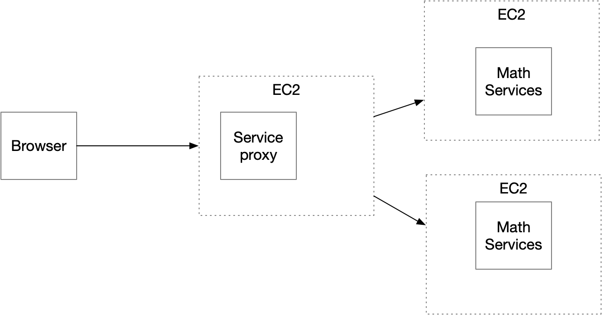
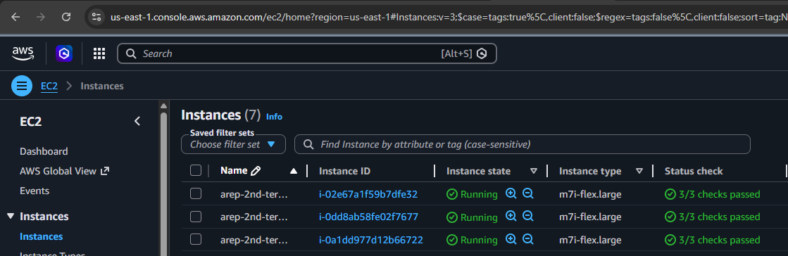
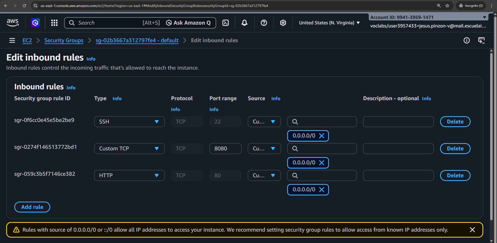
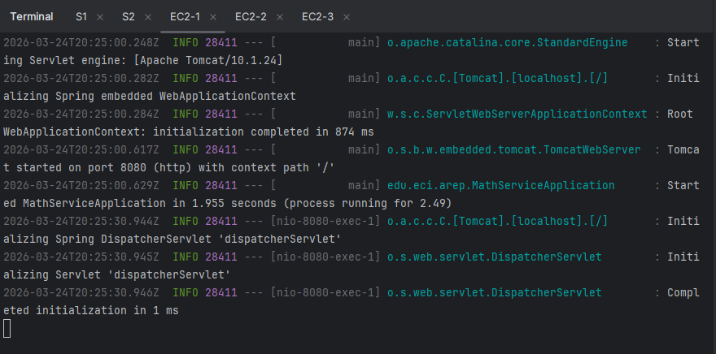
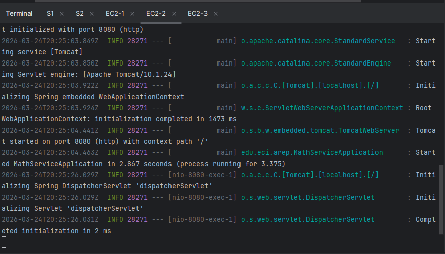
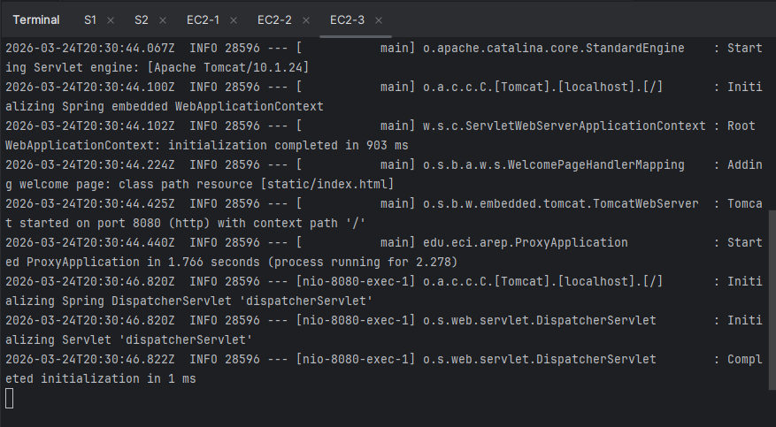
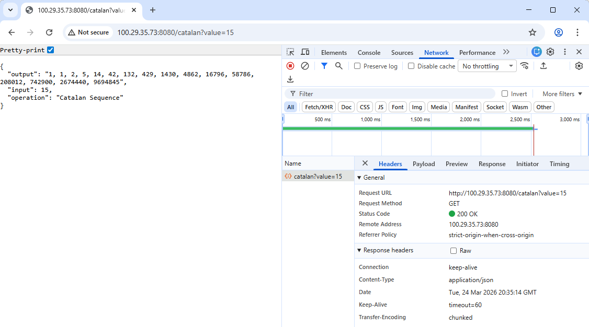
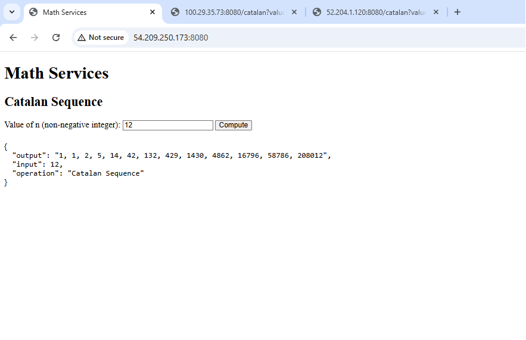

# Active-Passive Scheduling — Catalan Sequence Microservices

[](https://www.oracle.com/java/)
[](https://spring.io/projects/spring-boot)
[](https://maven.apache.org/)
[](https://aws.amazon.com/ec2/)
[](LICENSE)



> **Enterprise Architecture (AREP)** — Second Term Exam  
> A microservices prototype implementing an active-passive scheduling algorithm to compute the Catalan number sequence, deployed on AWS EC2.

---

## 🌐 **Overview**

This project implements a **distributed microservices system** composed of three AWS EC2 instances:

- **Two Math Service instances** that independently compute the Catalan number sequence
- **One Service Proxy** that routes client requests using an **active-passive algorithm**: requests are always forwarded to the active instance, and if it fails, the proxy transparently switches to the passive one

The **client** is a minimal HTML5 + JavaScript web application served directly from the proxy, which invokes the REST service asynchronously without any external libraries.

---

### Active-Passive Algorithm

- All requests are forwarded to the **active instance** (EC2 #1 by default)
- If the active instance is **unreachable** (connection timeout or error), the proxy **automatically switches** to the passive instance (EC2 #2)
- Instance URLs are configured via **OS environment variables** (`MATH_SERVICE_1`, `MATH_SERVICE_2`), following the [12-Factor App](https://12factor.net/config) methodology

---

## 🧮 **Mathematical Foundation**

The Catalan numbers are defined by the recurrence:

$$C_0 = 1$$

$$C_n = \sum_{i=0}^{n-1} C_i \cdot C_{n-1-i}, \quad n \geq 1$$

The implementation uses **dynamic programming**, computing each $C_n$ from previously computed values using `BigInteger` arithmetic to support arbitrarily large results.

**Example output for** `n = 10`:

```
1, 1, 2, 5, 14, 42, 132, 429, 1430, 4862, 16796
```

---

## 📁 **Project Structure**

```
AREP-parcial-active-passive-scheduling/
├── LICENSE
├── README.md
├── assets/
│   └── images/
├── math-service/
│   ├── pom.xml
│   └── src/main/
│       ├── java/edu/eci/arep/
│       │   ├── MathServiceApplication.java
│       │   └── controller/
│       │       └── MathController.java
│       └── resources/
│           └── application.properties
└── proxy-service/
    ├── pom.xml
    └── src/main/
        ├── java/edu/eci/arep/
        │   ├── ProxyApplication.java
        │   ├── controller/
        │   │   └── ProxyController.java
        │   └── service/
        │       └── ActivePassiveBalancer.java
        └── resources/
            ├── application.properties
            └── static/
                └── index.html
```

---

## ✅ **Prerequisites**

- **Java 17** or higher
- **Maven 3.8+**
- **Git**
- Three **AWS EC2** instances running Amazon Linux 2023
- Port **8080** open in all Security Groups

---

## 💻 **Local Setup**

### 1. Clone the repository

```bash
git clone https://github.com/JAPV-X2612/AREP-second-term-exam.git
cd AREP-second-term-exam
```

### 2. Build both services

```bash
cd math-service && mvn clean package -DskipTests && cd ..
cd proxy-service && mvn clean package -DskipTests && cd ..
```

### 3. Run locally (three separate terminals)

```bash
# Terminal 1 — Math Service (active)
cd math-service
PORT=8081 java -jar target/math-service-1.0-SNAPSHOT.jar

# Terminal 2 — Math Service (passive)
cd math-service
PORT=8082 java -jar target/math-service-1.0-SNAPSHOT.jar

# Terminal 3 — Proxy
cd proxy-service
MATH_SERVICE_1=http://localhost:8081 \
MATH_SERVICE_2=http://localhost:8082 \
PORT=8080 java -jar target/proxy-service-1.0-SNAPSHOT.jar
```

### 4. Open the client

```
http://localhost:8080
```

---

## ☁️ **AWS EC2 Deployment**

### Step 1 — Install Java on all three EC2 instances

```bash
sudo dnf install -y java-17-amazon-corretto
java -version
```

### Step 2 — Upload JARs via SFTP

```bash
# Math Service → EC2 #1
sftp -i "my-key-2.pem" ec2-user@ec2-100-29-35-73.compute-1.amazonaws.com
put math-service/target/math-service-1.0-SNAPSHOT.jar /home/ec2-user/

# Math Service → EC2 #2
sftp -i "my-key-2.pem" ec2-user@ec2-52-204-1-120.compute-1.amazonaws.com
put math-service/target/math-service-1.0-SNAPSHOT.jar /home/ec2-user/

# Proxy → EC2 #3
sftp -i "my-key-2.pem" ec2-user@ec2-54-209-250-173.compute-1.amazonaws.com
put proxy-service/target/proxy-service-1.0-SNAPSHOT.jar /home/ec2-user/
```

### Step 3 — Run services on each EC2

**EC2 #1 — Math Service (active):**
```bash
ssh -i "my-key-2.pem" ec2-user@ec2-100-29-35-73.compute-1.amazonaws.com
PORT=8080 java -jar math-service-1.0-SNAPSHOT.jar
```

**EC2 #2 — Math Service (passive):**
```bash
ssh -i "my-key-2.pem" ec2-user@ec2-52-204-1-120.compute-1.amazonaws.com
PORT=8080 java -jar math-service-1.0-SNAPSHOT.jar
```

**EC2 #3 — Service Proxy:**
```bash
ssh -i "my-key-2.pem" ec2-user@ec2-54-209-250-173.compute-1.amazonaws.com
MATH_SERVICE_1=http://100.29.35.73:8080 \
MATH_SERVICE_2=http://52.204.1.120:8080 \
PORT=8080 java -jar proxy-service-1.0-SNAPSHOT.jar
```

### Step 4 — Access the application

```
http://54.209.250.173:8080
```

---

## 📡 **API Reference**

### Math Service (direct)

| Method | Endpoint | Parameter | Description |
|--------|----------|-----------|-------------|
| `GET` | `/catalan` | `value` (int ≥ 0) | Returns Catalan sequence from $C_0$ to $C_n$ |

**Example:**
```
GET http://100.29.35.73:8080/catalan?value=10
```

**Response:**
```json
{
  "operation": "Secuencia de Catalan",
  "input": 10,
  "output": "1, 1, 2, 5, 14, 42, 132, 429, 1430, 4862, 16796"
}
```

### Proxy Service

| Method | Endpoint | Parameter | Description |
|--------|----------|-----------|-------------|
| `GET` | `/proxy/catalan` | `value` (int ≥ 0) | Delegates to the active Math Service instance |

**Example:**
```
GET http://54.209.250.173:8080/proxy/catalan?value=10
```

---

## 📸 **Screenshots**

### EC2 Instances Running



*Three EC2 instances in running state on AWS Console*

### Security Group Inbound Rules



*Inbound rules allowing SSH (22), HTTP (80), and custom TCP (8080)*

### Math Service Started — EC2 #1



*Spring Boot Math Service running on EC2 #1, port 8080*

### Math Service Started — EC2 #2



*Spring Boot Math Service running on EC2 #2, port 8080*

### Proxy Service Started — EC2 #3



*Spring Boot Proxy Service running on EC2 #3, port 8080*

### Math Service Direct Response



*Direct request to Math Service EC2 #1 returning Catalan sequence JSON*

### Browser Client — Proxy UI



*HTML client served from the proxy, successfully computing and displaying the Catalan sequence*

---

## 🎬 **Demo Video**

> A short demonstration video showing the full system in operation, including the active-passive failover, is available at:

📎 [Watch Demo Video](assets/videos/2nd-term-exam-video-demo.mov)

---

## 👥 **Author**

<table>
  <tr>
    <td align="center">
      <a href="https://github.com/JAPV-X2612">
        
        <br />
        <sub><b>Jesús Alfonso Pinzón Vega</b></sub>
      </a>
      <br />
      <sub>Full Stack Developer</sub>
    </td>
  </tr>
</table>

---

## 📄 **License**

This project is licensed under the **Apache License, Version 2.0** — see the [LICENSE](LICENSE) file for details.

---

## 🔗 **Additional Resources**

- [Spring Boot Documentation](https://docs.spring.io/spring-boot/docs/current/reference/html/)
- [Maven Documentation](https://maven.apache.org/guides/)
- [AWS EC2 User Guide — Amazon Linux 2023](https://docs.aws.amazon.com/linux/al2023/ug/what-is-amazon-linux.html)
- [12-Factor App Methodology](https://12factor.net/)
- [Catalan Numbers — Wikipedia](https://en.wikipedia.org/wiki/Catalan_number)
- [BigInteger — Java SE 17 Documentation](https://docs.oracle.com/en/java/docs/api/java.base/java/math/BigInteger.html)
- [Active-Passive vs Active-Active HA](https://www.digitalocean.com/community/tutorials/what-is-high-availability)
